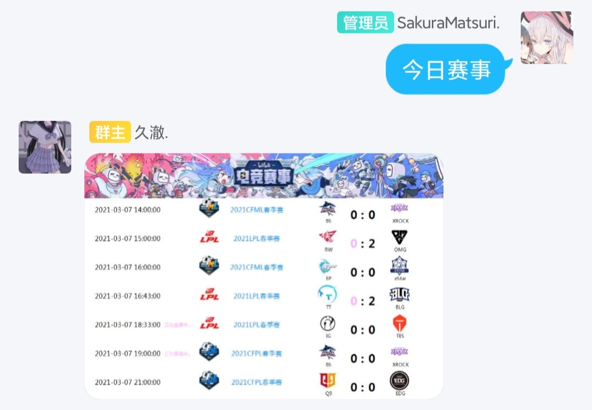
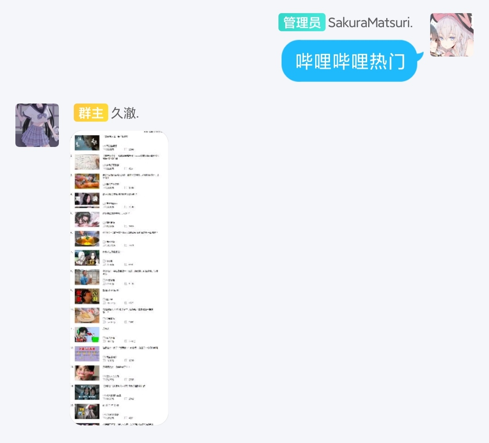

# 其他

#### 最新视频+UID/名字

* 例：
* 最新视频316381099
* 最新视频鹿乃ちゃん

#### 直播日历+uid/名字（UID和名字也可以不加，直接发送直播日历）

* 例：
* 直播日历316381099
* 直播日历鹿乃ちゃん
* 直播日历

#### 今日赛事

* 作用：查看哔哩哔哩直播赛事

#### 哔哩哔哩热门

* 作用：查看当前热门视频排行榜

#### GIF制作

* 例：
* GIF制作BV17x411w7KC 15-10
* GIF制作AV170001 15-10
* 用法：
* GIF制作 + BV/AV号 + 空格 + 从第几秒开始 - 持续后面几秒

#### AV号/BV号

* 在群里直接发送AV号或者BV号，即可获得视频详情和链接
* 发送视频链接同样也可以触发
* B站分享QQ同样也可以触发

