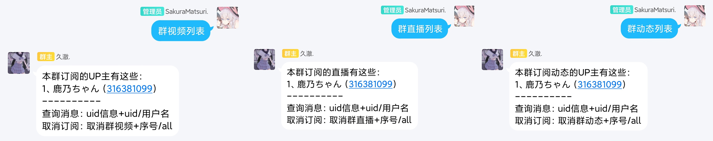

# 群取消订阅

### ！重要：若使用序号取消订阅，则先查看群订阅列表，可在下一个文档中具体查看。（群视频，直播，动态订阅列表互不相通，序号也有可能不同，请逐一查看。）

#### 取消群视频+序号/用户名/all

* 例：
* 取消群视频1
* 取消群视频鹿乃ちゃん
* 取消群视频all（注意：此条命令会取消所有视频订阅！）

#### 取消群直播+序号/用户名/all

* 例：
* 取消群直播1
* 取消群直播鹿乃ちゃん
* 取消群直播all（注意：此条命令会取消所有直播订阅！）

#### 取消群订阅+序号/用户名/all

* 例：
* 取消群动态1
* 取消群动态鹿乃ちゃん
* 取消群动态all（注意：此条命令会取消所有动态订阅！）

